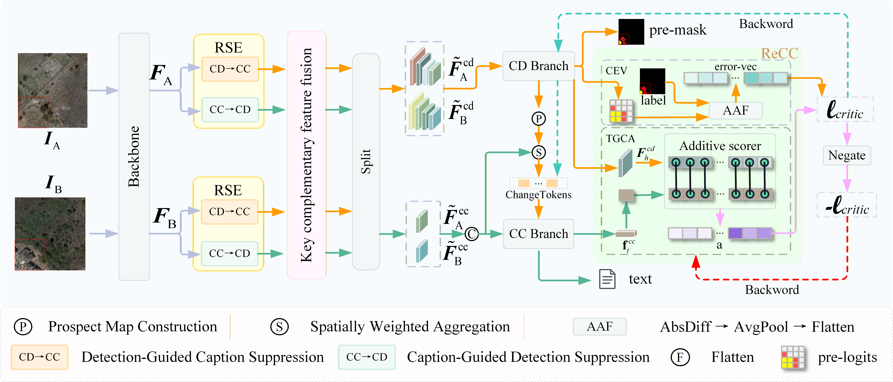

# Learning to Change by Critique and Correction: A Synergistic Framework for Remote Sensing Change Detection and Captioning

**Huafeng Li, Yamin Zhang, Yunbin Tu, Yafei Zhang, Wen Wang, and Liang
Li**

------------------------------------------------------------------------

## Share us a ⭐ if you find this repository useful

Official PyTorch implementation of the paper:

**"Learning to Change by Critique and Correction: A Synergistic
Framework for Remote Sensing Change Detection and Captioning"** in [[IEEE] (https://ieeexplore.ieee.org/document/xxxxxx)]  ***(Accepted by IEEE TIP 2026)*** 

## Overview

Remote sensing change detection (CD) and change captioning (CC) aim to
identify changes between bi-temporal remote sensing images and generate
semantic descriptions of these changes.

Existing methods usually adopt shared feature extraction followed by
task-specific branches, but they lack effective cross-task feedback and
mutual refinement.

This work proposes a Critique-Correction synergistic framework that
establishes a closed-loop interaction between change detection and
change captioning. The framework enables each task to critique
prediction errors and provide corrective guidance for improving the
other task.
<br>
    <div align="center">
      
    </div>
    <br>

## Dataset

We evaluate our framework on two widely used remote sensing change datasets:

- **LEVIR-MCI**: A multi-level change interpretation dataset containing bi-temporal remote sensing images, change detection masks, and descriptive captions. It is used for jointly evaluating change detection and change captioning tasks.

- **WHU-CD**: A widely used building change detection dataset, which is adopted to evaluate the generalization ability of the proposed framework for change detection.

### 1. LEVIR-MCI Dataset

The LEVIR-MCI dataset can be downloaded from:

[LEVIR-MCI Dataset](https://huggingface.co/datasets/lcybuaa/LEVIR-MCI/tree/main)

### 2. WHU-CDC Dataset

The WHU-CDC dataset can be downloaded from:

[WHU-CDC Dataset](https://www.kaggle.com/datasets/yuehaozhang1109/whu-cdc)


Dataset structure:

    -/DATA_PATH_ROOT/Levir-MCI-dataset/
    ├─LevirCCcaptions.json
    ├─images
      ├── train
      │     ├── A
      │     ├── B
      │     ├──label
      ├── val/
      │     ├── A
      │     ├── B
      │     ├──label
      ├── test/
            ├── A
            │── B
            ├──label

where folder ``A`` contains pre-phase images, folder ``B`` contains post-phase images, and folder label contains the change detection masks. 

**Extract descriptive text files for each image pair in the dataset, such as LEVIR-MCI.**
```
python preprocess_data.py
```
  After that, you can find some generated files in `./data/LEVIR_MCI/`. 

## Environment Installation

Create environment:

``` bash
conda create -n LCCC python=3.9
conda activate LCCC
```

Install dependencies:

``` bash
pip install -r requirements.txt
```


## Training
Make sure you performed the data preparation above. Then, start training as follows:
``` bash
python train.py
```

## Evaluation

``` bash
python test.py
```

The model outputs change detection results and generated change
descriptions.

## Citation

``` bibtex
@ARTICLE{LCCC,
  author={Li, Huafeng and Zhang, Yamin and Tu, Yunbin and Zhang, Yafei and Wang, Wen and Li, Liang},
  title={Learning to Change by Critique and Correction: A Synergistic Framework for Remote Sensing Change Detection and Captioning},
  year={202X}
}
```

## License

This repository is released for academic research purposes only.

## Contact Us

If you have any questions, please feel free to contact us.
